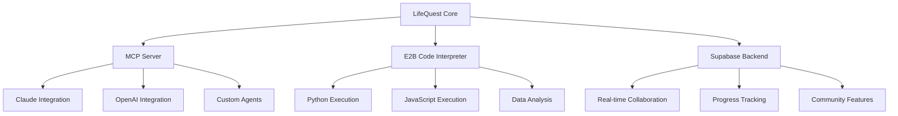

# 🚀 LifeQuest - Vision & Manifest

> **"Ein Cheatcode für die 1%, die die AI-Welle richtig reiten wollen"**  
> *A cheat code for the 1% who want to ride the AI wave correctly*

## 🎯 The Core Philosophy

### Real Life is a Game. LifeQuest is Your Cheat Code.

Every successful entrepreneur, developer, and creator knows this secret: **Life operates like a complex RPG game** with rules, levels, achievements, and hidden mechanics. The difference between those who thrive and those who merely survive is understanding these mechanics.

**LifeQuest transforms this understanding into actionable intelligence.**

### The AI Revolution is Creating a New Social Class

We're not just witnessing technological change—we're experiencing **social stratification** based on AI fluency:

#### 🏆 **AI Natives** (The 1%)
- Seamlessly integrate AI into daily workflows
- Use AI as a thinking partner, not just a tool
- Build systems that leverage AI capabilities
- **Create value through AI amplification**

#### 🎯 **AI Adopters** (The 10%)
- Learning to use AI tools effectively
- Experimenting with AI workflows
- Building AI literacy
- **Adapting to the new paradigm**

#### 😴 **AI Resistant** (The 89%)
- Viewing AI as "just another tool"
- Resistant to workflow changes
- Missing the compound advantages
- **Being disrupted by AI Natives**

**LifeQuest is your bridge from any category to AI Native status.**

---

## 🤖 Cutting-Edge AI Integration

LifeQuest integrates the latest AI models and technologies to create the most advanced gamified life platform:

### **Latest AI Models Integrated:**
- **🧠 Grok 4**: Advanced reasoning for complex quest planning (256K context, $0.002/1M tokens)
- **⚡ GPT-5**: Best-in-class coding and agentic task automation  
- **🚀 GPT-5 Mini**: Fast, cost-efficient for real-time interactions
- **🔬 O3 Deep Research**: Most powerful model for life analytics and insights
- **🎨 GPT Image 1**: State-of-the-art image generation for avatars and rewards

### **Interactive Code Interpreter:**
- **E2B Integration**: Secure, sandboxed code execution in browser
- **Programming Quests**: Learn coding through gamified challenges
- **Multi-Language Support**: Python, JavaScript, TypeScript, Java, C++, Rust, Go
- **Real-Time Feedback**: AI-powered code analysis and improvement suggestions

### **Smart AI Features:**
- 🎯 **Personalized Quest Generation**: AI creates custom challenges based on your profile
- 📊 **Adaptive Difficulty**: Dynamic adjustment based on performance and learning curve  
- 🔮 **Predictive Analytics**: AI predicts optimal learning paths and success probability
- 🤝 **Intelligent Crew Matching**: AI-powered team formation for optimal collaboration
- 💡 **Real-Time Coaching**: AI mentor provides contextual guidance and motivation

### **📚 Complete AI Documentation:**
- **[AI Models Integration Guide](docs/AI_MODELS_INTEGRATION.md)** - Complete setup and usage
- **[E2B Code Interpreter Setup](docs/E2B_CODE_INTERPRETER.md)** - Interactive programming features
- **[AI-Powered Quest Features](docs/QUEST_AI_FEATURES.md)** - Smart gamification capabilities
- **[Model Selection Guide](docs/MODEL_SELECTION_GUIDE.md)** - Choose the right AI for each task
- **[AI API Endpoints](docs/API_ENDPOINTS_AI.md)** - Complete API reference

---

## 🎮 The LifeQuest Concept

### From Mundane to Magnificent

Transform every aspect of your life into engaging quests with measurable progression:

#### 📚 **Learning Quests**
- **Traditional**: "I should learn Python"  
- **LifeQuest**: Epic skill tree with 50 micro-challenges, AI coding mentor, real-time feedback, and community leaderboards

#### 💼 **Career Quests**
- **Traditional**: "I need to get promoted"  
- **LifeQuest**: Strategic campaign with skill assessments, networking missions, AI-powered career coaching, and progress tracking

#### 🏃 **Health Quests**
- **Traditional**: "I should exercise more"  
- **LifeQuest**: Adventure campaigns with boss battles (challenging workouts), AI nutrition coaching, and crew-based challenges

#### 🧠 **Personal Development Quests**
- **Traditional**: "I want to be more productive"  
- **LifeQuest**: Comprehensive system optimization with AI workflow analysis, habit tracking, and personalized improvement strategies

### The Agent Connection

Your **Real-Life Agent ID** isn't just a profile—it's your **digital avatar** that connects to a network of specialized AI agents:

#### 🤖 **Personal AI Crew**
- **Quest Coach**: Helps design optimal quest structures
- **Progress Tracker**: Monitors advancement and identifies bottlenecks  
- **Habit Analyst**: Optimizes behavior patterns
- **Goal Strategist**: Long-term planning and milestone setting
- **Motivation Specialist**: Maintains engagement and momentum

#### ⚡ **Code Execution Agents**
- **E2B Integration**: Real code execution for programming quests
- **Automation Agents**: Handle repetitive tasks automatically
- **Data Analysts**: Process progress metrics and generate insights
- **API Orchestrators**: Connect with external services and tools

#### 🌐 **Community Intelligence**
- **Collective Learning**: Learn from successful quest patterns
- **Peer Matching**: Connect with others on similar journeys
- **Success Templates**: Pre-built quest frameworks from top performers
- **Knowledge Sharing**: Contribute to and benefit from community wisdom

---

## 🧠 Technical Innovation

### MCP (Model Context Protocol) Integration

LifeQuest is built as a **first-class citizen** in the emerging AI agent ecosystem:



#### Why This Matters:
- **Context Preservation**: Your quest progress informs all AI interactions
- **Agent Coordination**: Multiple AI agents work together seamlessly  
- **Tool Integration**: Execute real actions, not just generate ideas
- **Scalable Intelligence**: Add new AI capabilities without rebuilding

### Real-Time Agent Coordination

```typescript
// Example: AI agents collaborating on quest optimization
const questOptimization = await orchestrateAgents({
  analysisAgent: "Analyze user's completion patterns",
  strategistAgent: "Design optimal quest structure", 
  motivationAgent: "Create engagement mechanics",
  validatorAgent: "Test quest feasibility"
});
```

### Gamification Engine

Built on proven game design principles:

- **Variable Ratio Reinforcement**: Unpredictable rewards maximize engagement
- **Progressive Skill Trees**: Clear advancement paths with branching options
- **Social Proof Mechanics**: Leaderboards, achievements, crew collaboration
- **Flow State Optimization**: Dynamic difficulty adjustment based on performance
- **Meaningful Choice Architecture**: Every decision impacts your journey

---

## 🌍 Open Source Strategy

### Why Open Source is Our Competitive Advantage

#### 1. **Network Effects**
- More users → Better AI training data → Better recommendations → More users
- Community contributions → Faster development → Better features → Stronger community

#### 2. **Trust & Transparency**  
- **Data Privacy**: Users control their information
- **Algorithm Transparency**: No black box decision-making
- **Extensibility**: Build custom features for specific needs
- **Vendor Independence**: No platform lock-in

#### 3. **Developer Ecosystem**
- **Plugin Architecture**: Third-party integrations
- **Custom Quest Types**: Industry-specific implementations
- **White-label Solutions**: Branded versions for organizations
- **AI Agent Marketplace**: Community-built agents

### Contribution Strategy

#### **The 1% Understand This:**
Contributing to LifeQuest isn't charity—it's **strategic positioning**:

- **Reputation Building**: Demonstrate AI-native development skills
- **Network Access**: Connect with other high-performers
- **Early Advantage**: Shape the tools you'll use daily
- **Knowledge Amplification**: Learn from diverse perspectives

#### **Community Growth Model:**
```
Individual Contributors → Core Community → Power Users → Enterprise Customers
```

---

## 🎯 Target Market

### Primary: AI-Curious High Performers

#### **Entrepreneurs & Founders**
- Building AI-first companies
- Need systematic approach to skill development  
- Value productivity and performance optimization
- Understand compound advantages

#### **Software Developers**
- Want to integrate AI into personal workflows
- Interested in cutting-edge technology
- Value open-source solutions
- Understand technical implementation

#### **Content Creators & Consultants**
- Use AI to enhance output quality
- Need structured approach to skill building
- Value community and collaboration
- Monetize expertise and knowledge

#### **Students & Lifelong Learners**
- Gamify educational experiences
- Need motivation and structure
- Value AI tutoring and guidance
- Build portfolios and skills

### Geographic Focus

#### **DACH Region** (Germany, Austria, Switzerland)
- German-first experience with English support
- Strong engineering culture
- Privacy-conscious user base
- High adoption of productivity tools

#### **Silicon Valley & Tech Hubs**
- Early adopter mentality
- High AI awareness
- Strong developer communities
- Willingness to pay for productivity gains

#### **Global Remote Workers**
- Location-independent professionals
- Need structure in distributed work
- Value digital community
- Understand AI productivity benefits

---

## 📊 Success Metrics & Vision

### Individual Success Indicators
- **Quest Completion Rate**: 70%+ (vs 20% for traditional goals)
- **Skill Acquisition Velocity**: 3x faster learning with AI coaching
- **Habit Formation**: 80%+ success rate with gamified approach
- **Community Engagement**: Active participation in crew quests

### Platform Success Metrics
- **Monthly Active Users**: Growing community of AI-native individuals
- **Agent Utilization**: High engagement with AI coaching features
- **Community Contributions**: Thriving open-source ecosystem
- **Success Stories**: Documented life improvements through LifeQuest

### Long-term Vision (2024-2027)

#### **Phase 1: Foundation** (Q1-Q2 2024)
- Core gamification engine
- MCP integration with Claude
- Basic quest types and progression
- German/English localization

#### **Phase 2: Intelligence** (Q3-Q4 2024)
- Advanced AI coaching agents
- Crew collaboration features
- E2B code execution quests
- Mobile companion app

#### **Phase 3: Ecosystem** (2025)
- Plugin marketplace
- Enterprise/team features
- Third-party integrations
- Global community events

#### **Phase 4: Platform** (2026-2027)
- AI agent development platform
- White-label solutions
- API ecosystem for developers
- Industry-specific implementations

---

## 🚀 Competitive Positioning

### What Makes LifeQuest Different

#### vs. Traditional Productivity Apps
- **Engagement**: Game mechanics vs. boring todo lists
- **Intelligence**: AI-powered vs. static features  
- **Community**: Collaborative vs. isolated experience
- **Growth**: Skill development vs. task completion

#### vs. Other Gamification Platforms
- **AI Integration**: MCP connectivity vs. simple point systems
- **Real Execution**: E2B code running vs. theoretical progress
- **Open Source**: Community-owned vs. proprietary platforms
- **Agent-Native**: Built for AI era vs. retrofitted solutions

#### vs. AI Productivity Tools
- **Systematic**: Structured quest progression vs. ad-hoc assistance
- **Gamified**: Engaging experience vs. utilitarian interfaces
- **Community**: Social learning vs. individual interactions
- **Holistic**: Life-wide approach vs. specific use cases

### The Unfair Advantage

1. **First-Mover in AI-Gamification Convergence**
2. **Open Source Network Effects** 
3. **MCP Protocol Native Architecture**
4. **Real Code Execution Capabilities**
5. **Community-Driven Development**
6. **German Market Cultural Fit**

---

## 🔮 The Bigger Picture

### Beyond Personal Productivity

LifeQuest is ultimately about **human flourishing in an AI-powered world**:

#### **Individual Impact**
- **AI Fluency**: Natural collaboration with intelligent systems
- **Continuous Learning**: Adaptive skill development  
- **System Thinking**: Understanding complex cause-and-effect
- **Community Building**: Creating value through connections

#### **Societal Impact**
- **Democratizing AI**: Open-source tools accessible to everyone
- **Reducing Inequality**: Equal access to AI-powered growth
- **Fostering Innovation**: Creative problem-solving at scale
- **Building Resilience**: Distributed knowledge and capabilities

#### **Economic Impact**
- **New Creator Economy**: Monetizing quest templates and coaching
- **Skill Market Efficiency**: Better matching of abilities to opportunities
- **Productivity Renaissance**: Orders of magnitude improvement in human potential
- **Innovation Acceleration**: AI-human collaboration unlocking new possibilities

---

## 🎪 Call to Action

### For Developers
**Build the future of human-AI collaboration.** 
Contribute to the open-source framework that will define how we work, learn, and grow in the AI era.

### For Early Users  
**Become an AI Native today.**
Transform your daily routine into an engaging quest system with AI-powered coaching and community support.

### For Organizations
**Give your team the cheat code.**
Deploy LifeQuest to systematically upgrade your organization's capabilities and performance.

### For Investors
**Back the platform that bridges human potential and AI capability.**
LifeQuest positions itself at the intersection of massive trends: AI adoption, gamification, and remote work.

---

## 🏆 The Ultimate Goal

**LifeQuest isn't just about productivity—it's about identity.**

In a world where AI capability becomes table stakes, the differentiator is **how well you collaborate with intelligent systems**. LifeQuest trains that collaboration through engaging, structured experiences.

We're not building an app. We're building **the operating system for human development in the AI age**.

The 1% already understand this. The question is: **Will you join them?**

---

**Real Life is a Game. LifeQuest is your cheat code.**

**Ready to level up?** 🚀

---

*This document serves as the philosophical foundation and strategic vision for LifeQuest. It should be revisited and updated as we learn from our community and evolve our understanding of human-AI collaboration.*

**Current Version**: 1.0  
**Last Updated**: January 2024  
**Next Review**: April 2024